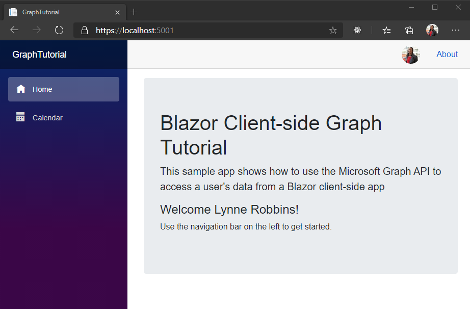

<!-- markdownlint-disable MD002 MD041 -->

Dans cet exercice, vous allez étendre l’application de l’exercice précédent pour prendre en charge l’authentification avec Azure AD. Cette opération est obligatoire pour obtenir le jeton d’accès OAuth nécessaire pour appeler l’API Microsoft Graph.

1. Open **./wwwroot/appsettings.js**. Ajoutez une `GraphScopes` propriété et mettez à jour les `Authority` `ClientId` valeurs et pour qu’elles correspondent à ce qui suit.

    :::code language="json" source="../demo/GraphTutorial/wwwroot/appsettings.example.json" highlight="3-4,7":::

    Remplacez `YOUR_APP_ID_HERE` par l’ID d’application de l’inscription de votre application.

    > [!IMPORTANT]
    > Si vous utilisez le contrôle de code source tel que git, il est maintenant recommandé d’exclure le **appsettings.jssur** le fichier à partir du contrôle de code source pour éviter une fuite accidentelle de votre ID d’application.

    Examinez les étendues incluses dans la `GraphScopes` valeur.

    - **User. Read** permet à l’application d’obtenir le profil et la photo de l’utilisateur.
    - **MailboxSettings. Read** permet à l’application d’obtenir des paramètres de boîte aux lettres, ce qui inclut le fuseau horaire préféré de l’utilisateur.
    - **Calendars. ReadWrite** permet à l’application de lire et d’écrire dans le calendrier de l’utilisateur.

## <a name="implement-sign-in"></a>Implémentation de la connexion

À ce stade, le modèle de projet .NET Core a ajouté le code permettant d’activer la connexion. Toutefois, dans cette section, vous allez ajouter du code supplémentaire pour améliorer l’expérience en ajoutant des informations de Microsoft Graph à l’identité de l’utilisateur.

1. Ouvrez **./pages/Authentication.Razor** et remplacez son contenu par ce qui suit.

    :::code language="razor" source="../demo/GraphTutorial/Pages/Authentication.razor" id="AuthenticationSnippet":::

    Cette opération remplace le message d’erreur par défaut lorsque la connexion ne parvient pas à afficher un message d’erreur renvoyé par le processus d’authentification.

1. Créez un répertoire dans la racine du projet nommé **Graph**.

1. Créez un fichier dans le répertoire **./Graph** nommé **GraphUserAccountFactory.cs** et ajoutez le code suivant.

    ```csharp
    using System.Security.Claims;
    using System.Threading.Tasks;
    using Microsoft.AspNetCore.Components.WebAssembly.Authentication;
    using Microsoft.AspNetCore.Components.WebAssembly.Authentication.Internal;
    using Microsoft.Extensions.Logging;
    using Microsoft.Graph;

    namespace GraphTutorial.Graph
    {
        // Extends the AccountClaimsPrincipalFactory that builds
        // a user identity from the identity token.
        // This class adds additional claims to the user's ClaimPrincipal
        // that hold values from Microsoft Graph
        public class GraphUserAccountFactory
            : AccountClaimsPrincipalFactory<RemoteUserAccount>
        {
            private readonly IAccessTokenProviderAccessor accessor;
            private readonly ILogger<GraphUserAccountFactory> logger;

            public GraphUserAccountFactory(IAccessTokenProviderAccessor accessor,
                ILogger<GraphUserAccountFactory> logger)
            : base(accessor)
            {
                this.accessor = accessor;
                this.logger = logger;
            }

            public async override ValueTask<ClaimsPrincipal> CreateUserAsync(
                RemoteUserAccount account,
                RemoteAuthenticationUserOptions options)
            {
                // Create the base user
                var initialUser = await base.CreateUserAsync(account, options);

                // If authenticated, we can call Microsoft Graph
                if (initialUser.Identity.IsAuthenticated)
                {
                    try
                    {
                        // Add additional info from Graph to the identity
                        await AddGraphInfoToClaims(accessor, initialUser);
                    }
                    catch (AccessTokenNotAvailableException exception)
                    {
                        logger.LogError($"Graph API access token failure: {exception.Message}");
                    }
                    catch (ServiceException exception)
                    {
                        logger.LogError($"Graph API error: {exception.Message}");
                        logger.LogError($"Response body: {exception.RawResponseBody}");
                    }
                }

                return initialUser;
            }

            private async Task AddGraphInfoToClaims(
                IAccessTokenProviderAccessor accessor,
                ClaimsPrincipal claimsPrincipal)
            {
                // TEMPORARY: Get the token and log it
                var result = await accessor.TokenProvider.RequestAccessToken();

                if (result.TryGetToken(out var token))
                {
                    logger.LogInformation($"Access token: {token.Value}");
                }
            }
        }
    }
    ```

    Cette classe étend la classe **AccountClaimsPrincipalFactory** et remplace la `CreateUserAsync` méthode. Pour l’instant, cette méthode journalise uniquement le jeton d’accès à des fins de débogage. Vous allez implémenter les appels Microsoft Graph plus loin dans cet exercice.

1. Ouvrez **./Program.cs** et ajoutez les `using` instructions suivantes en haut du fichier.

    ```csharp
    using Microsoft.AspNetCore.Components.WebAssembly.Authentication;
    using GraphTutorial.Graph;
    ```

1. À l’intérieur `Main` , remplacez l' `builder.Services.AddMsalAuthentication` appel existant par ce qui suit.

    :::code language="csharp" source="../demo/GraphTutorial/Program.cs" id="AddMsalAuthSnippet":::

    Examinez ce que fait ce code.

    - Il charge la valeur de `GraphScopes` à partir de **appsettings.js** et ajoute chaque étendue aux étendues par défaut utilisées par le fournisseur MSAL.
    - Il remplace la fabrique de comptes existante par la classe **GraphUserAccountFactory** .

1. Enregistrez vos modifications, puis redémarrez l’application. Utilisez le lien **se connecter** pour vous connecter. Passez en revue et acceptez les autorisations demandées.

1. L’application est actualisée avec un message de bienvenue. Accédez aux outils de développement de votre navigateur et passez en revue l’onglet de la **console** . L’application journalise le jeton d’accès.

    

## <a name="get-user-details"></a>Obtenir les détails de l’utilisateur

Une fois que l’utilisateur a ouvert une session, vous pouvez obtenir ses informations à partir de Microsoft Graph. Dans cette section, vous allez utiliser les informations de Microsoft Graph pour ajouter des revendications supplémentaires au **ClaimsPrincipal** de l’utilisateur.

1. Créez un fichier dans le répertoire **./Graph** nommé **GraphClaimsPrincipalExtensions.cs** et ajoutez le code suivant.

    :::code language="csharp" source="../demo/GraphTutorial/Graph/GraphClaimsPrincipalExtensions.cs" id="GraphClaimsExtensionsSnippet":::

    Ce code implémente des méthodes d’extension pour la classe **ClaimsPrincipal** qui vous permettent d’obtenir et de définir des revendications avec des valeurs d’objets Microsoft Graph.

1. Créez un fichier dans le répertoire **./Graph** nommé **BlazorAuthProvider.cs** et ajoutez le code suivant.

    :::code language="csharp" source="../demo/GraphTutorial/Graph/BlazorAuthProvider.cs" id="BlazorAuthProviderSnippet":::

    Ce code implémente un fournisseur d’authentification pour le kit de développement logiciel (SDK) Microsoft Graph qui utilise le **IAccessTokenProviderAccessor** fourni par le package **Microsoft. AspNetCore. Components. webassembly. Authentication** pour obtenir des jetons d’accès.

1. Créez un fichier dans le répertoire **./Graph** nommé **GraphClientFactory.cs** et ajoutez le code suivant.

    :::code language="csharp" source="../demo/GraphTutorial/Graph/GraphClientFactory.cs" id="GraphClientFactorySnippet":::

    Cette classe crée une **GraphServiceClient** configurée avec le **BlazorAuthProvider**.

1. Ouvrez **./Program.cs** et modifiez le **BaseAddress** du nouveau **httpclient** sur `"https://graph.microsoft.com"` .

    :::code language="csharp" source="../demo/GraphTutorial/Program.cs" id="HttpClientSnippet":::

1. Ajoutez le code suivant avant la `await builder.Build().RunAsync();` ligne.

    :::code language="csharp" source="../demo/GraphTutorial/Program.cs" id="AddGraphClientFactorySnippet":::

    Cela ajoute le **GraphClientFactory** en tant que service étendu que nous pouvons mettre à disposition via l’injection de dépendance.

1. Ouvrez **./Graph/GraphUserAccountFactory.cs** et ajoutez la propriété suivante à la classe.

    ```csharp
    private readonly GraphClientFactory clientFactory;
    ```

1. Mettez à jour le constructeur pour qu’il prenne un paramètre **GraphClientFactory** et affectez-le à la `clientFactory` propriété.

    :::code language="csharp" source="../demo/GraphTutorial/Graph/GraphUserAccountFactory.cs" id="ConstructorSnippet" highlight="2,7":::

1. Remplacez la fonction `AddGraphInfoToClaims` existante par ce qui suit.

    :::code language="csharp" source="../demo/GraphTutorial/Graph/GraphUserAccountFactory.cs" id="AddGraphInfoToClaimsSnippet":::

    Examinez ce que fait ce code.

    - Il [obtient le profil de l’utilisateur](https://docs.microsoft.com/graph/api/user-get).
        - Il utilise `Select` pour limiter les propriétés renvoyées.
    - Il [obtient la photo de l’utilisateur](https://docs.microsoft.com/graph/api/profilephoto-get).
        - Il demande spécifiquement la version en pixels 48 x 48 de la photo de l’utilisateur.
    - Il ajoute les informations au **ClaimsPrincipal**.

1. Ouvrez **./Shared/LoginDisplay.Razor** et effectuez les modifications suivantes.

    - Remplacez `/img/no-profile-photo.png` par `@(context.User.GetUserGraphPhoto() ?? "/img/no-profile-photo.png")` .
    - Remplacez `placeholder@contoso.com` par `@context.User.GetUserGraphEmail()` .

    ```razor
    ...
    

    ...

    <p class="dropdown-item-text text-muted mb-0">@context.User.GetUserGraphEmail()</p>
    ...
    ```

1. Enregistrez toutes vos modifications et redémarrez l’application. Connectez-vous à l’application. L’application se met à jour pour afficher la photo de l’utilisateur dans le menu supérieur. La sélection de la photo de l’utilisateur ouvre un menu déroulant avec le nom, l’adresse de messagerie et le bouton de **déconnexion** de l’utilisateur.

    

    
